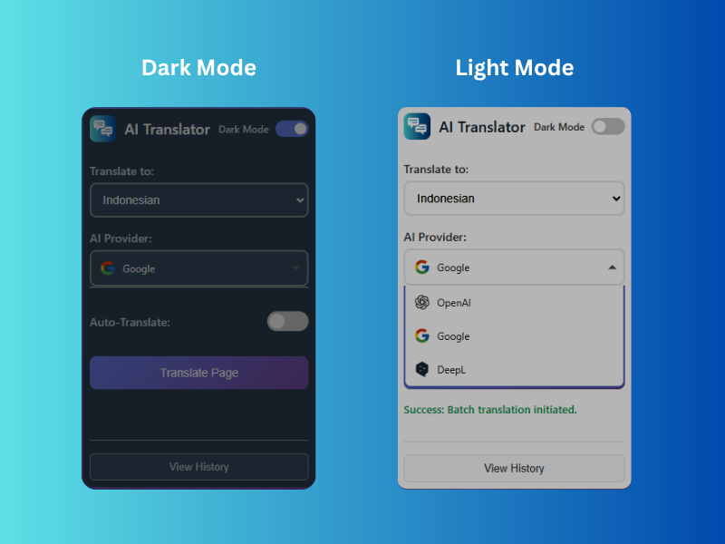

<p align="center">
  <a href="https://github.com/hk-dev13/ai-translator.git">
    
  </a>
</p>

<h1 align="center">
AI Web Translator
</h1>

<h2 align="center">A powerful Chrome extension for translating web pages using AI, with secure and scalable backend middleware.</h2>

<div align="center">


[](https://github.com/hk-dev13/ai-translator/actions/workflows/deploy-backend.yml)

</div>

<div align="center">

</div>

> [!TIP]
> **What's New**: **UI Enhancements** Added **history.html** and **history.js** to provide a dedicated translation history page.

---

## ✨ Features

- **Web Page Translation**: Translate entire web pages or selected text with one click
- **Multiple AI Providers**: Supports Google Translate API (currently), with extensions for OpenAI, Deepseek, etc.
- **Smart Caching**: Cache translations for optimal performance and reduced API costs
- **Rate Limiting**: Protection from abuse with rate limiting
- **Offline Support**: Standalone web app for text translation without extension
- **Modern UI**: User-friendly popup for translation controls

## 🏗️ Architecture

This project consists of three main components:

### 1. Chrome Extension
- **manifest.json**: Manifest V3 extension configuration
- **background.js**: Service worker to handle API calls to backend
- **content.js**: Script injected into web pages for text extraction and translation injection
- **popup.html/css/js**: Popup UI for language and AI provider controls

### 2. Backend Middleware (Google Cloud Run)
- **Node.js + Express**: Secure API server
- **Google Translate API**: Main translation engine
- **Redis Caching**: Translation caching for efficiency
- **Rate Limiting**: 10 requests/minute per IP
- **Secret Management**: API keys securely stored in Google Secret Manager

### 3. Standalone Web App
- **HTML/CSS/JS**: Simple web app for text translation
- **Dummy Data**: Demo with static data (not API calls)

## 🚀 Instalasi & Setup

### Prerequisites
- Node.js 18+
- Google Cloud SDK (for backend deployment)
- Chrome Browser

### 1. Setup Backend
```bash
cd backend
npm install
```

### 2. Setup Secrets in Google Cloud
- Create GCP project: `chrome-translator-dev`
- Enable Google Translate API
- Setup Secret Manager for API key
- Setup Redis (Upstash or GCP Memorystore)

### 3. Deploy Backend
Backend automatically deploys via GitHub Actions when pushing to main branch.

Manual deploy:
```bash
cd backend
gcloud run deploy translator-backend \
  --source . \
  --platform managed \
  --region asia-southeast1 \
  --allow-unauthenticated
```

### 4. Install Chrome Extension
1. Open `chrome://extensions/`
2. Enable "Developer mode"
3. Load unpacked → select project root folder
4. Extension will install with unique ID

### 5. Update CORS in Backend
Update `backend-example.js` with correct extension ID:
```javascript
app.use(cors({ origin: ['chrome-extension://YOUR_EXTENSION_ID'] }));
```

## 📖 Usage

### Chrome Extension
1. Click the extension icon in the toolbar
2. Select target language and AI provider
3. Click "Translate Page"
4. The page will be translated in real-time

### Standalone Web App
1. Open `public/index.html` in browser
2. Enter text and select languages
3. Click "Translate" for demo results

## 🔧 Technologies

- **Frontend Extension**: JavaScript ES6+, Chrome Extension API
- **Backend**: Node.js, Express, Google Cloud Run
- **AI**: Google Translate API v2
- **Caching**: Redis (Upstash)
- **Security**: Helmet, CORS, Rate Limiting
- **CI/CD**: GitHub Actions
- **Deployment**: Google Cloud Run

## 📊 API Endpoints

### POST /translate
Translate single text or batch.

**Request:**
```json
{
  "text": "Hello world",
  "targetLang": "id",
  "provider": "google"
}
```

**Batch Request:**
```json
{
  "texts": ["Hello", "World"],
  "targetLang": "id",
  "provider": "google"
}
```

**Response:**
```json
{
  "translation": "Halo dunia"
}
```

## 🔒 Security

- API keys stored in Google Secret Manager
- Rate limiting prevents abuse
- CORS only allows specific extension IDs
- Strict input validation
- Cache reduces API calls

## 🚀 Roadmap

- [ ] Add OpenAI API support
- [ ] Add Deepseek API support
- [ ] Add Ollama local support
- [ ] UI improvements
- [ ] Support more languages
- [ ] Analytics and monitoring

## 📝 [License](LICENSE)

</div>